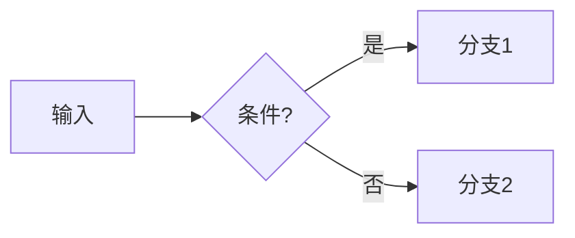

> [!标题]
> 这部分主要展示了不同标题的字体大小

# 一级标题 H1

## 二级标题 H2

### 三级标题 H3

#### 四级标题 H4

##### 五级标题 H5

###### 六级标题 H6

> [!内部链接]
> 这是 Obsidian 的

使用 `[[]]` 即可进行内部链接，进行文章之间的跳转，例如： [[关于我]] 。

> [!标签]
> 

例如我可以在本篇文章中进行 #深度学习  的引用，你也可以查看到相应的文章。

> [!文本样式]

使用 `**要被包围的文字**` 可以变成粗体。

**粗体**
*斜体* 
***粗斜体***  
~~删除线~~  
==高亮==  

下标示例：H~1~O
上标示例：x^2^

---

## 行内代码

行内代码示例：`console.log("Hello Markdown")`

---

## 多段落文本

多段落文本，测试中文段落间距与行高。  
第二行带两个空格的显式换行。  
第三行继续。

---

## 引用块

> 一级引用：这是一段引用文字，测试主题的引用样式。
>
> > 二级引用：嵌套引用以观察缩进与边框效果。
>
> 再补一句，看看行距是否一致。

---

## 列表

### 无序列表

- 项目 A  
  - 子项目 A-1  
  - 子项目 A-2  
- 项目 B  
- 项目 C  

### 有序列表

1. 步骤一  
2. 步骤二  
   3. 子步骤 2.1  
   4. 子步骤 2.2  
5. 步骤三  

### 任务列表（Task List）

- [x] 已完成任务  
- [ ] 待办任务  
  - [ ] 子任务 1  
  - [ ] 子任务 2  

---

## 定义列表（部分解析器支持）

术语一  
: 这是术语一的定义说明  

术语二  
: 这是术语二的定义说明  

---

## 链接与图片

外部链接：[OpenAI](https://openai.com)  

### 网络图片


---

## 代码块（多语言）

### **Python**

```python
def greet(name: str) -> str:
    return f"Hello, {name}!"

if __name__ == "__main__":
    print(greet("Obsidian"))
````

### **JavaScript**

```javascript
function sum(a, b) {
  return a + b;
}
console.log(sum(2, 3));
```

### **JSON**

```json
{
  "name": "obsidian",
  "version": "1.0.0",
  "features": ["markdown", "plugins", "themes"]
}
```

### **Shell**

```shell
#!/usr/bin/env bash
echo "测试 Shell 渲染与代码高亮"
```

### **HTML**

```html
<div class="card"><strong>HTML 渲染测试</strong></div>
```

### **CSS**

```css
.card {
  padding: 12px;
  border-radius: 12px;
}
```

---

## **流程图（Mermaid）**



---

## **表格**


### **基本表格**

|**姓名**|**年龄**|**爱好**|
|---|---|---|
|张三|25|篮球|
|李四|30|音乐|
|王五|28|阅读|

### **对齐与长文本测试**

|**列A（左对齐）**|**列B（居中）**|**列C（右对齐）**|
|---|---|---|
|左侧文字|中间文字|123,456.78|
|多行说明换行测试|✅|**加粗右对齐**|

---

## **分割线**

---

## **数学公式（KaTeX / MathJax）**

  

行内公式：

$E = mc^2$ ， $\alpha + \beta = \gamma$

  

块级公式：

  

$$

\int_0^1 x^2 , dx = \frac{1}{3}

$$

  

对齐环境（解析器支持时）：

  

$$

\begin{aligned}

a &= b + c \\

x &= y^2 - z

\end{aligned}

$$

---

## **Callout（Obsidian 特有）**

  

> [!note] Note

> 这是一个 note 提示。

  

> [!info] Info

> 信息提示块。

  

> [!tip] Tip

> 小技巧与提示。

  

> [!success] Success

> 操作成功的反馈。

  

> [!question] Question

> 这里提出一个问题？

  

> [!warning] Warning

> 警告信息。

  

> [!failure] Failure

> 失败状态提示。

  

> [!danger] Danger

> 危险 / 严重警告。

  

> [!bug] Bug

> 缺陷记录或错误提示。

  

> [!example] Example

> 示例 / 样例说明。

  

> [!quote] Quote

> 「学而时习之，不亦说乎？」

  

### **可折叠 Callout（部分主题支持）**

  

> [!note]- 可折叠的 Note

> 点击标题可展开 / 折叠内容。

---

## **脚注**

  

这是一个脚注示例[^1]，再来一个脚注[^2]。

---

## **任务 / 进度与标签**

- 第 1 周 #周报 #Obsidian
    
- 第 2 周 ✅
    
- 第 3 周 ⏳
    

---

## **内嵌 HTML（主题可能自定义处理）**

<div style="padding:12px;border-radius:12px;border:1px solid #ccc;">
  <strong>内嵌 HTML 渲染测试</strong>
</div>

---

## **Emoji 与特殊符号**

  

😀 😎 🚀 ✨ ✅ ❌ ➕ ➖ ➡️ ™ © ®

---

## **脚注说明**
  

[^1]: 脚注一的详细说明。 

[^2]: 脚注二的详细说明。 
